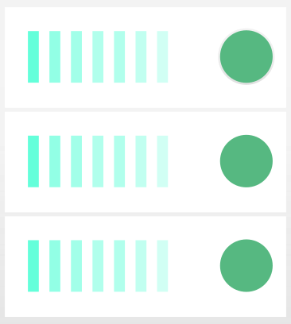

<h1 align='center'>AWS Batch Starter</h1>

  

## Overview

This repository contains everything to get you started with AWS Batch and the AWS CDK.

The goal is to schedule batch jobs on the spot market running docker containers at massive scale.

Read the blog post at https://eng.ruumi.io/post/planet-scale-radar.html

Here's the rough outline
1. You provide a Docker image and push it to AWS ECR for the tasks to run
2. You set up and deploy the AWS Batch environment with clusters and queues
3. You send messages to the batch queue to start jobs; scale out happens automatically

Note: We use Docker and Docker Compose for self-contained reproducible environments throughout this project.

## 1. Docker Image

Each task will run a container from a Docker image stored in AWS ECR.

The [Dockerfile](./Dockerfile) bundles up the [main.sh](./main.sh) script a task will run.

To build and publish the Docker image to AWS ECR, run

    make

    make publish account=MY-AWS-ACCOUNT-NUMBER region=eu-central-1

## 2. AWS Batch

We provide an AWS CDK stack for the AWS Batch environment in the [cdk](./cdk) directory, for scheduling tasks onto auto-scaling clusters and running the Docker container from the image stored in ECR.

Before deploying make sure to read, understand, and adapt [cdk/index.ts](cdk/index.ts) to your needs.
In there we define the compute environments, cluster limits, and so on.
There is a high chance you want to adapt it.

Here is a checklist to set up a new account before we can deploy stacks from this project
- [x] [Bootstrap](https://docs.aws.amazon.com/cdk/latest/guide/bootstrapping.html) the AWS CDK in the AWS Account

To set up the cdk deployment, run

    cd cdk

    docker-compose build
    docker-compose run dev bash

And in the container, run

    npm ci

set up credentials to deploy

    export AWS_ACCESS_KEY_ID=
    export AWS_SECRET_ACCESS_KEY=
    export AWS_DEFAULT_REGION=

Build and deploy

    npm run build

    npm run cdk ls
    npm run cdk synth BatchStarterStack
    npm run cdk deploy BatchStarterStack

Note: every time you change [cdk/index.ts](cdk/index.ts) you will have to re-compile with `npm run build`

For AWS CDK documentation, see
- https://docs.aws.amazon.com/cdk/latest/guide/core_concepts.html
- https://docs.aws.amazon.com/cdk/api/latest/docs/aws-construct-library.html

## 3. Start Jobs

To submit a job

    aws batch submit-job --job-name MyJob \
      --job-queue <job-queue-arn> \
      --job-definition <job-definition-arn> \
      --parameters MyParam=MyValue

To get job queue ARNs

    aws batch describe-job-queues --query "jobQueues[].jobQueueArn" --output text

To get job definition ARNs

    aws batch describe-job-definitions --query "jobDefinitions[].jobDefinitionArn" --output text

For AWS CLI documentation, see
- https://docs.aws.amazon.com/cli/latest/reference/batch/

## Spot Instance Limit

There is a Spot Instance Limit you might hit.

By default, the AWS Batch environment runs on C, M, and R instance types.

You can request a Spot Instance limit increase in the AWS console, see
- https://docs.aws.amazon.com/AWSEC2/latest/UserGuide/using-spot-limits.html

## License

Copyright © 2021 robofarm

Distributed under the MIT License (MIT).
